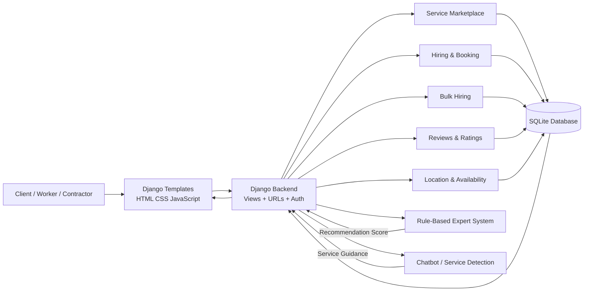

# 🛠️ LabourLink — Smart Worker Hiring Platform

A **Django-based service marketplace** that connects clients with workers and contractors for local services such as plumbing, electrical work, carpentry, painting, cleaning, gardening, vehicle care, event services, and more.

LabourLink supports **individual worker hiring, bulk workforce requests, worker/contractor recommendations, location-aware matching, job management, reviews, availability tracking, and an intelligent chatbot**.

The project is designed as a practical full-stack web application that demonstrates **Python/Django development, database management, role-based workflows, recommendation logic, and rule-based AI**.

---

## 📌 Description

Finding a suitable local worker can be difficult when users have to compare many service providers manually.

**LabourLink** provides a centralized platform where users can:

- Browse and search available services
- View suitable workers and contractors
- Compare providers using ratings, success rate, experience, availability, and distance
- Book an individual worker
- Request multiple workers from a contractor
- Track booking and job status
- Submit ratings and reviews
- Manage worker availability and location
- Get assistance from the built-in chatbot

The application supports three main roles:

```text
                 LABOURLINK
                     │
        ┌────────────┼────────────┐
        ↓            ↓            ↓
      CLIENT       WORKER      CONTRACTOR
        │            │            │
        │            │            └── Manage bulk requests
        │            └────────────── Manage hires
        └────────────────────────── Search & hire
```

---

# 🧠 High-Level Architecture

The application follows a **Django monolithic architecture** where the Django application handles the user interface, business logic, authentication, recommendation system, chatbot, and database communication.


### Architecture Flow



### Main Data Flow

```text
User
  ↓
Django Web Interface
  ↓
Django Views / Business Logic
  │
  ├── Services & Search
  │       ↓
  │   Worker / Contractor Data
  │
  ├── Individual Hiring
  │       ↓
  │     Hire
  │
  ├── Bulk Hiring
  │       ↓
  │   BulkRequest
  │
  ├── Ratings & Reviews
  │       ↓
  │   Worker / Contractor Statistics
  │
  ├── Location & Availability
  │       ↓
  │   Distance + Capacity Checks
  │
  ├── Rule-Based Expert System
  │       ↓
  │   Recommendation Score
  │
  └── Chatbot
          ↓
     Service Detection
          ↓
     Booking Guidance

          ↓
      SQLite Database
          ↓
     Updated Dashboard
```

---

# 🚀 Key Features

## 👥 Multi-Role User System

LabourLink provides separate workflows for:

### 👤 Client / User
- Register and log in
- Browse services
- Search for workers
- View worker details
- Book individual workers
- Submit bulk-hiring requests
- Track current and previous hires
- Submit reviews and ratings
- Manage profile information

### 👷 Worker
- Register as a worker
- Select a service category
- Set service area
- Manage availability
- Save location
- View incoming hire requests
- Accept, complete, or cancel jobs
- Maintain job statistics
- Receive ratings and reviews

### 🏢 Contractor
- Register as a contractor
- Define service category and operating area
- Manage total and available workers
- Receive bulk-hiring requests
- Accept, complete, reject, or cancel bulk requests
- Track project statistics
- Receive contractor ratings and reviews

---

## 🔎 Service Search & Discovery

Users can access a dedicated services marketplace containing multiple service categories, including examples such as:

- Electrician
- Plumber
- Carpenter
- Painter
- Tiles Worker
- Welder
- Driver
- Car Wash
- Bike Wash
- Cook
- Household Helper
- Gardener
- Pest Control Worker
- Water Tank Cleaning
- Home Organizer
- Event Decorator
- Bouncer
- Loading/Unloading Worker
- Warehouse Labour
- Packers & Movers Helper

The project can be extended with additional services through the Django database.

---

## 📅 Individual Worker Hiring

Users can book a specific worker by providing:

- Contact information
- Address
- Problem/job description
- Date
- Time slot
- Location coordinates

The booking moves through status states such as:

```text
Pending
   ↓
Accepted
   ↓
Completed
   │
   └──→ Review & Rating

Pending
   ↓
Cancelled
```

---

## 👷‍♂️ Bulk Hiring

For larger jobs, users can request multiple workers from contractors.

The bulk hiring workflow considers:

- Required service
- Number of workers
- Area
- Start date
- End date
- Time slot
- Contractor availability
- Existing reservations
- Location
- Recommendation score

Before accepting a request, the system recalculates effective worker availability to reduce over-booking.

---

## 📍 Location-Aware Matching

Worker and contractor profiles can store:

- Latitude
- Longitude
- Service area

The backend calculates distance between the user and service provider and uses it as part of the recommendation process.

---

## ⭐ Ratings & Reviews

After completed work, users can provide:

- Star rating
- Written comment

The system uses review information to calculate provider performance indicators such as average rating and success rate.

---

## 🤖 Intelligent Chatbot

LabourLink contains a built-in chatbot that can:

- Detect service-related requests
- Recognize common user questions
- Explain how to book a worker
- Guide users to the Services page
- Answer common questions about location, price, booking, and platform functionality

The chatbot uses **keyword detection and regular-expression pattern matching**, making its responses deterministic and easy to understand.

---

# 🧠 Machine Learning & Personalization

> **Implementation note:** The current version uses a **Rule-Based Expert System (RBES)** rather than a statistical Machine Learning model. The recommender is intentionally transparent and deterministic, so the README describes the intelligent matching logic accurately rather than claiming a trained ML model that is not present in the current code.

## Rule-Based Expert System

The recommendation engine evaluates workers and contractors using domain-specific scoring rules.

### Worker Recommendation

The worker score combines:

| Factor | Weight |
|---|---:|
| Rating | 35% |
| Success Rate | 30% |
| Proximity | 25% |
| Completed Jobs / Experience | 10% |

The resulting score is in the range:

```text
0.000 → 1.000
```

A higher score indicates a stronger recommendation.

### Contractor Recommendation

The contractor score combines:

| Factor | Weight |
|---|---:|
| Rating | 35% |
| Success Rate | 30% |
| Proximity | 20% |
| Available Workforce | 15% |

This makes the system suitable for bulk-hiring decisions where workforce capacity is important.

---

## 🎯 Personalization / Intelligent Matching

The recommendation engine uses provider-specific information:

```text
Rating
   +
Success Rate
   +
Distance
   +
Experience / Workforce Capacity
   ↓
Rule-Based Score
   ↓
Ranked Providers
   ↓
Recommended Worker / Contractor
```

### Worker experience tiers

```text
0 jobs          → 0.20
1–10 jobs       → 0.50
11–50 jobs      → 0.75
51–150 jobs     → 0.90
151+ jobs       → 1.00
```

### Contractor capacity tiers

```text
0–4 workers     → 0.10
5–14 workers    → 0.40
15–29 workers   → 0.70
30–49 workers   → 0.90
50+ workers     → 1.00
```

---

## ⚠️ Recommendation Penalties

The expert system also applies penalty rules for risk conditions.

### Worker penalties

- Rating below 2.0 → 20% penalty
- No completed jobs → 15% penalty
- Distance above 20 km → 30% penalty

### Contractor penalties

- Rating below 2.0 → 20% penalty
- No previous projects → 10% penalty
- Distance above 25 km → 30% penalty

These rules make the recommendation process more explainable than a black-box prediction model.

---

# 📊 Performance Metrics

The current system exposes practical **matching and provider-performance metrics** rather than claiming benchmark ML accuracy.

## Recommendation Metrics

- Recommendation score: **0.000–1.000**
- Worker rating: **0–5 stars**
- Worker success rate: **0–100%**
- Contractor success rate: **0–100%**
- Worker completed jobs
- Contractor completed projects
- Available workforce
- Distance from user
- Provider ranking order

## Worker Performance

```text
Average Rating
      +
Completed Jobs
      +
Total Jobs
      ↓
Success Rate
      ↓
Recommendation Score
```

## Contractor Performance

```text
Average Rating
      +
Completed Projects
      +
Total Projects
      +
Available Workers
      ↓
Success Rate + Capacity
      ↓
Recommendation Score
```

## System-Level Checks

The expert system includes self-tests for representative worker and contractor cases and verifies that stronger candidates receive higher scores than weaker candidates.

> The project does not currently publish a fixed ML accuracy, precision, recall, F1 score, or production latency benchmark because the recommendation engine is rule-based rather than trained on a labeled dataset.

---

# 🛠️ Tech Stack

## Backend

| Technology | Purpose |
|---|---|
| Python | Application development |
| Django | Full-stack web framework |
| Django ORM | Database operations |
| Django Authentication | Login, registration, sessions, password reset |
| SQLite | Relational database |

## Frontend

| Technology | Purpose |
|---|---|
| HTML5 | Page structure |
| CSS3 | Styling and responsive UI |
| JavaScript | Client-side interactions |
| Django Templates | Dynamic server-rendered pages |

## Intelligent Components

| Technology | Purpose |
|---|---|
| Rule-Based Expert System | Worker and contractor recommendation |
| Keyword Matching | Service detection |
| Regular Expressions | Chatbot intent/pattern detection |
| Distance Calculation | Location-aware provider matching |

## Development

| Technology | Purpose |
|---|---|
| Git | Version control |
| GitHub | Repository hosting |
| SQLite | Local development database |

---

# 📁 Project Structure

```text
LabourLink/
│
├── core/
│   ├── migrations/
│   │   └── 0001_initial.py ... 0028_*.py
│   │
│   ├── static/
│   │   ├── css/
│   │   │   └── chatbot.css
│   │   ├── js/
│   │   │   └── chatbot.js
│   │   └── images/
│   │       ├── plumber.png
│   │       ├── carpenter.png
│   │       ├── electrician.png
│   │       ├── gardener.png
│   │       └── ...
│   │
│   ├── templates/
│   │   └── chatbot.html
│   │
│   ├── admin.py
│   ├── ai.py
│   ├── expert_system.py
│   ├── models.py
│   ├── urls.py
│   ├── utils.py
│   ├── validators.py
│   └── views.py
│
├── labourlink/
│   ├── __init__.py
│   ├── settings.py
│   ├── urls.py
│   ├── asgi.py
│   └── wsgi.py
│
├── media/
│   └── services/
│       ├── carpenter.png
│       ├── electrician.png
│       ├── painter.png
│       ├── plumber.png
│       └── ...
│
├── templates/
│   ├── core/
│   ├── worker/
│   ├── registration/
│   ├── base.html
│   ├── home.html
│   ├── services.html
│   ├── service_detail.html
│   ├── login.html
│   ├── register_user.html
│   ├── register_worker.html
│   ├── register_contractor.html
│   ├── user_dashboard.html
│   ├── worker_dashboard.html
│   ├── contractor_dashboard.html
│   ├── bulk_hire.html
│   ├── my_bookings.html
│   └── ...
│
├── manage.py
├── db.sqlite3
├── .gitignore
├── labourlink_architecture.png
└── README.md
```

### Core Data Models

```text
User
 ├── ClientProfile
 ├── Worker
 │     └── Service
 └── ContractorProfile
       └── Service

Worker
 └── Hire
       └── Review

ContractorProfile
 └── BulkRequest
       └── BulkReview
```

---

# ⚙️ Getting Started

## 1. Prerequisites

Install:

- Python 3.10+
- Git
- VS Code or another code editor
- A modern web browser

---

## 2. Clone the Repository

```bash
git clone YOUR_GITHUB_REPOSITORY_URL
cd LabourLink
```

---

## 3. Create a Virtual Environment

### Windows PowerShell

```powershell
python -m venv venv
```

Activate it:

```powershell
venv\Scripts\Activate.ps1
```

If PowerShell blocks script execution, you can activate the environment using Command Prompt:

```cmd
venv\Scripts\activate
```

### macOS / Linux

```bash
python3 -m venv venv
source venv/bin/activate
```

---

## 4. Install Django

The current project does not include a `requirements.txt` file, so install Django directly:

```bash
pip install django
```

Verify the installation:

```bash
python -m django --version
```

---

## 5. Apply Database Migrations

From the directory containing `manage.py`:

```bash
python manage.py migrate
```

The project uses SQLite for local development.

---

## 6. Create an Admin Account

```bash
python manage.py createsuperuser
```

Follow the prompts to create the administrator account.

---

## 7. Start the Development Server

```bash
python manage.py runserver
```

Open:

```text
http://127.0.0.1:8000/
```

Django admin:

```text
http://127.0.0.1:8000/admin/
```

---

# 🔄 Main Application Workflow

## Individual Hiring

```text
User
 ↓
Services
 ↓
Select Service
 ↓
View Workers
 ↓
Compare / Recommended Worker
 ↓
Book Now
 ↓
Hire Request
 ↓
Worker Accepts
 ↓
Job Completed
 ↓
User Reviews Worker
```

## Bulk Hiring

```text
User
 ↓
Bulk Hire
 ↓
Select Service + Number of Workers
 ↓
Enter Area / Date / Time
 ↓
Check Contractor Capacity
 ↓
Calculate Distance
 ↓
Calculate Recommendation Score
 ↓
Recommended Contractor
 ↓
Submit Bulk Request
 ↓
Contractor Accepts / Rejects
 ↓
Project Completed
 ↓
Bulk Review
```

---

# 🔐 Security & Development Notes

- Django authentication and session management are used for user access.
- Password reset views are included.
- User, worker, and contractor records are linked through Django's authentication system.
- `db.sqlite3` is configured for local development.
- The project `DEBUG` setting is currently enabled for development.
- `SECRET_KEY` is currently present in `settings.py` and should be moved to an environment variable before production deployment.
- `ALLOWED_HOSTS` should be configured for the production domain.
- The included `.gitignore` excludes the SQLite database, Python cache files, virtual environments, and environment files.

> **Before pushing to GitHub:** make sure real credentials, private data, virtual environments, and unnecessary generated files are not committed.

---

# 🎯 Project Objectives

- Build a centralized platform for hiring local service professionals.
- Simplify worker and contractor discovery.
- Provide both individual and bulk hiring workflows.
- Improve provider selection using transparent recommendation rules.
- Use location and availability to make matching more practical.
- Track job completion and provider performance.
- Provide ratings and reviews for service quality.
- Assist users through an integrated chatbot.
- Demonstrate full-stack development using Python and Django.

---

# 🔮 Future Enhancements

- Online payment integration
- Real-time chat between clients and workers
- Push/email/SMS notifications
- Advanced ML recommendation model trained on historical bookings
- Provider availability calendar
- Improved geospatial search
- Worker verification and document validation
- Multi-language support
- Mobile application
- Advanced analytics dashboard
- Cloud deployment
- Production email configuration
- Automated service-price estimation

---

# 👨‍💻 Project Highlights

This project demonstrates practical experience in:

- Full-stack web development
- Python programming
- Django framework
- Django ORM and relational databases
- Authentication and role-based workflows
- CRUD operations
- Service marketplace design
- Individual and bulk booking systems
- Location-aware matching
- Rule-based recommendation systems
- Explainable AI logic
- Pattern-based chatbot development
- Ratings and review systems
- Database migrations
- Responsive web interface development
